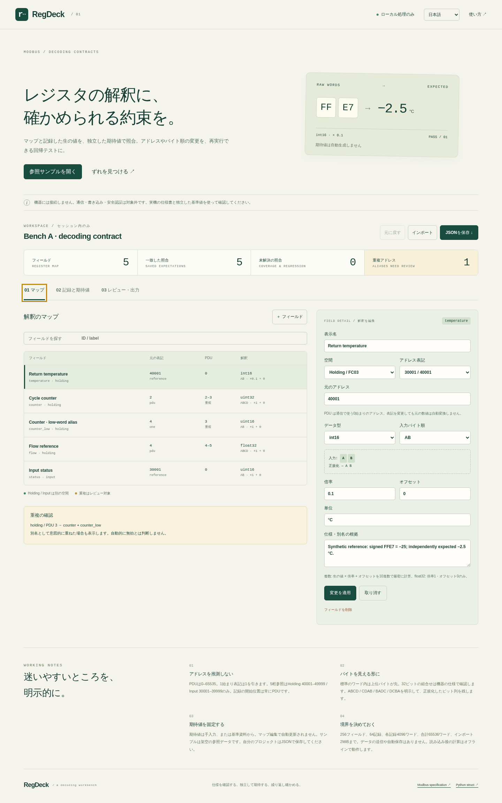

# RegDeck

**レジスタマップを、独立した期待値で確かめる。**

RegDeck is a local-only Modbus map-to-regression-fixture workbench. It joins a register interpretation map, recorded raw words, and independently supplied expectations into a portable review artifact.

Its central promise is deliberately small: **editing the map never regenerates expectations**. An address-base or byte-order change must face the same recorded words and reference values.



## Quick start

Node.js 22+ is needed only for the local development server and tests. Python 3.10+ runs the exported verifier without third-party packages.

```sh
npm ci --ignore-scripts
npm run build
npm run serve
# Open http://127.0.0.1:4173
```

`dist/` is a static site. Its relative modules support deployment under a subpath such as `/reg-deck/`; the authored browser CI uses that subpath. Serve it from a static host or the included loopback-only server. ES modules require an HTTP(S) origin; double-clicking index.html as a file is not the supported route.

```sh
python3 python/verify.py fixtures/reference.json
python3 python/verify.py fixtures/address-drift.json --json
# The second command intentionally exits 1.
```

## Five-minute demo / 5分のデモ

1. Open the reference example. Five saved assertions pass. A deliberate counter alias remains visible at holding PDU 3
2. Inspect temperature: source reference 40001 → PDU 0; FFE7 → int16 −25 → exact decimal ×0.1 → −2.5
3. Open “Find an address drift.” Only the map address changes. The expectation −2.5 remains, so the assertion fails
4. Undo. Edit a snapshot or enter your own expected value. Unapplied edits must be applied or cancelled before navigation/export
5. Export project JSON and verify.py to the same folder, then run `python3 verify.py regdeck-project.json`

日本語と英語を切り替えられます。データはセッション内だけで保持します。再読み込みすると参照サンプルに戻るため、作業はJSONで保存してください。サンプルは架空の参照データであり、実機の測定記録ではありません。

## What it does

- Explicit PDU, one-based register and five-digit reference conventions; no guessing from a number
- Separate holding and input spaces, with exact overlapping PDU cells and alias notes
- uint16, int16, uint32, int32, IEEE-754 float32
- AB/BA for 16-bit; ABCD/CDAB/BADC/DCBA for 32-bit, plus canonical bit patterns
- Exact decimal integer scaling and offset; binary32 exact decimal display, signed zero and nonfinite categories
- Recorded-word snapshots and independent expected values with absolute tolerance
- Versioned project/fixture JSON, map CSV with normalized PDU spans, dependency-free Python verifier and printable HTML
- Atomic import, preserved expectations, bounded inputs, reversible undo, explicit incomplete coverage

## Boundaries

There is **no device connection, serial access, network scanning, register write or control logic**. The app does not poll, commission equipment, verify function-code transactions or provide safety certification. It does not infer undocumented types or choose an expectation for the user. Consult the device's documentation and an independent known reading.

No coils, packed bits, strings, BCD, 64-bit values, vendor timestamps, PDF extraction, arbitrary formulas or float scaling. 32-bit word order is a selected device convention, not a universal rule inferred from the Modbus specification.

All fields in a snapshot's space are evaluated. A shorter capture leaves out-of-range fields **missing**. A field without any same-space snapshot is **unasserted**. A project passes only when it has at least one assertion and every result passes. An intentional alias is a review warning, not a failed assertion. Nonfinite actual values are visible and pass only against an explicit matching special expectation.

### Limits

- 256 fields, 64 snapshots
- 4096 words per snapshot, 65536 words total
- 2 MiB imported bytes and compact project data; depth 12
- 40-character plain decimal strings, at most 18 fractional digits; no exponent notation
- Stable IDs: initial ASCII letter, then letters/digits/\_/-, max 40
- Labels/names 120 Unicode codepoints, unit 40, note 1000; controls rejected except LF/TAB in notes

Schema, exact comparison semantics and CSV rules: [docs/FORMAT.md](docs/FORMAT.md).

## Verification

```sh
npm run check
npm run test:browser   # after serving dist and installing Playwright Chromium
```

At the repaired review freeze, 41 Node tests and 39 Python tests passed, together with 2,104 differential decode vectors, 1,006 complete projects, 21 strict-import parity cases and four exported-verifier CLI cases. The generated verifier bytes match the tested standalone source. See [docs/VERIFICATION.md](docs/VERIFICATION.md) for current counts and execution limits.

[Hosted functional CI](https://github.com/Masanori-Spec/reg-deck/actions/runs/37172852245) passed all four Node 22/24 × Python 3.10/3.12 jobs and **15 sandboxed Chromium scenarios**. Actual desktop, 390px mobile, downloaded-report and print output were inspected. The example report prints on two A4 pages. See [visual evidence](docs/VISUAL_REVIEW.md). The independent review was interrupted and remains incomplete; this release does not claim a completed independent audit. No live-device or separately deployed public-app validation is claimed.

## Why this project

Existing converters, Modbus clients and simulators already handle substantial pieces. RegDeck focuses on a static, portable, independently asserted regression contract. This is a scoped workflow choice, not a claim that any individual feature is new. [Primary-source comparison](docs/COMPARISON.md) · [Interview explanation](docs/INTERVIEW.md).

## Layout

- `src/core.mjs`: strict schema/parser, address normalization, exact arithmetic, comparison and overlap review
- `src/export.mjs`: CSV import/export and escaped static reports
- `web/`: Japanese/English interface and transactional editing
- `python/verify.py`: independently implemented standalone verifier
- `tests/differential.mjs`: seeded JS/Python comparison and separate integer/cell oracles
- `tests/browser/`: sandboxed Chromium scenarios and evidence output

No runtime packages, analytics, remote fonts, uploads, localStorage or device APIs. After the app's modules have loaded, computation and exports run offline. Offline reload/caching is not promised. Dependencies are development-only and recorded in `package-lock.json`. No project license grant has been added; third-party dependency notices are listed separately.
